# Arduino Bluetooth car with Lego

This repository contains the source code of my Arduino Bluetooth car built years ago with Lego.<br>
The code was written between 2015 and 2016, when I was younger, be patient if it's difficult to read ;)<br>
This car has **Autonomous Emergency Brake** and **autonomous lights** as standard.

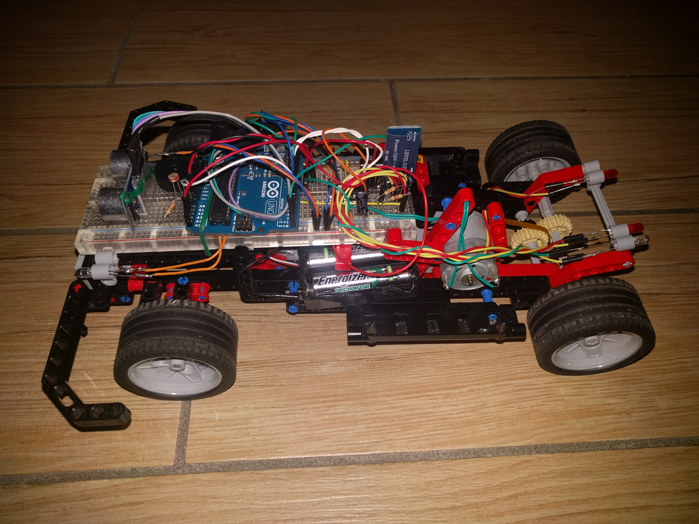

This car has a 90 degree **steering wheel**. This movement is carried out using a **servo motor** embedded inside the car.<br>
This Lego car is completely self-made: I removed the gearmotor from my grandfather's old printer, 
I cut the battery container from an old RC controller and I took all the Legos from my old toy (Lego technic 8041).<br>
I also learned to use the soldering iron and I never got burned using it!

## How it works:

The last version of my Arduino car works with Bluetooth, using **HC-06 module**: this means that I had to create an 
Android application that could send commands to my car.

At that time I was certainly not able to write apps for Android in Java, so I had to arrange 
with [App Inventor](https://appinventor.mit.edu/).<br>
If you want to edit the application you can import `Mark_8_controller.aia` in your App Inventor account.
<br>
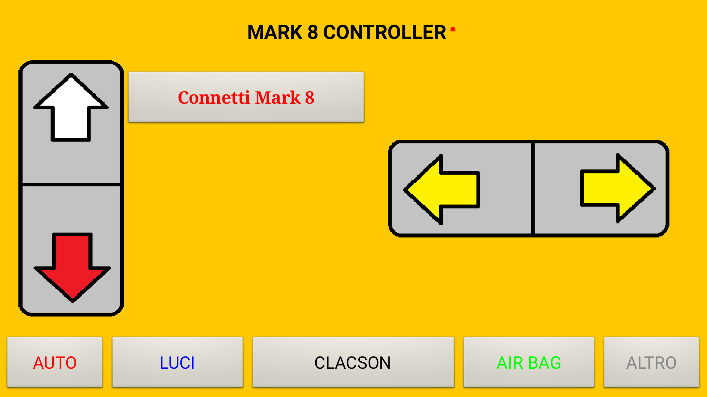
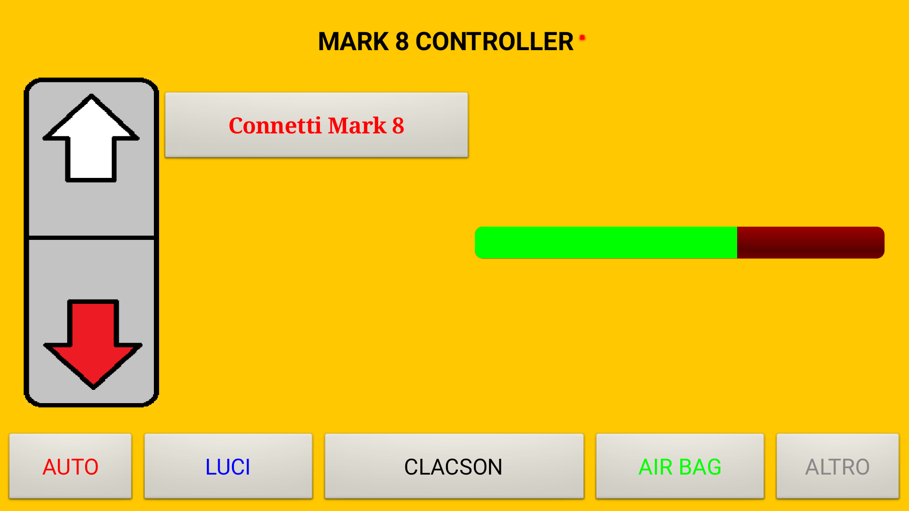
<br>
The application is able to detect all Bluetooth devices and establish a connection.
After connecting you can control the car in 2 ways: with the *buttons* or using the *accelerometer* of your smartphone.<br>

The app send this types of command to the Bluetooth module:
* SINISTRA:         Steer left
* DESTRA:           Steer right
* DRITTO:           Steer forward
* AVANTI:           Motor forward
* INDIETRO:         Motor back
* CLACSON:          Use clacson
* LUCION:           Turn on lights
* LUCIOFF:          Turn off lights
* LUCIAUTO:         Auto lights (with brightness sensor)
* AIRBAGON:         Turn on Autonomus Emergency Brake
* AIRBAGOFF:        Turn off Autonomus Emergency Brake
* AUTOON:           Autopilot beta on
* AUTOOFF:          Autopilot beta off
* DISCONNESSIONE:   Disconnection

<br>
The HC-06 bluetooth module must be connected to Arduino serial TX and RX. When new data is available it will be parsed.
The code below shows an example of receiving the command.<br>
NOTE: When you upload new code to Arduino remember to disconnect the HC-06 module from TX and RX.

```c
void loop() {
	...
	while (Serial.available()) {
		delay(8);
		char c = Serial.read();
		readString += c;
	}

	if (readString.length() > 0) {
		Serial.println(readString);

		if (readString == "SINISTRA") {
		  Sterzo.write(sinistra);
		}
		
		...
	}
}
```

## Components:
These are all the components used in the last version of the car:<br>

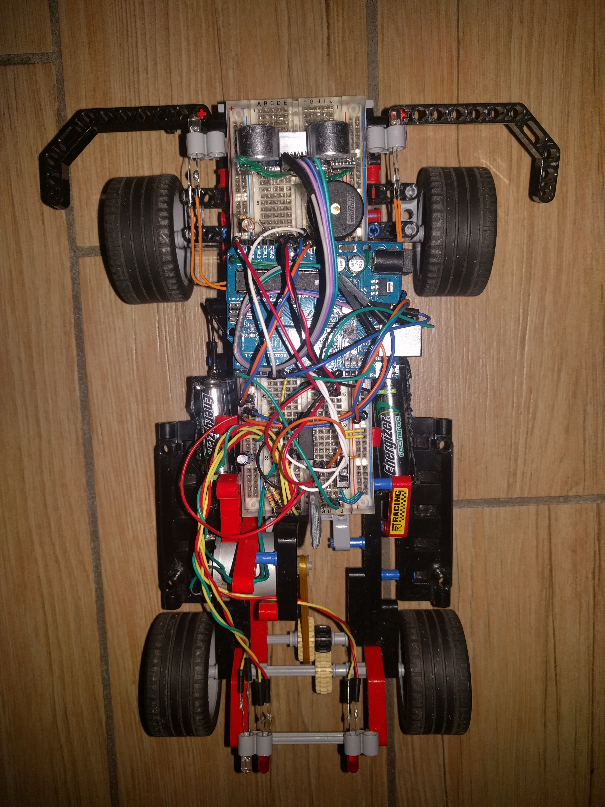

* Arduino Uno rev3
* 9V DC motor
* L293D: dual H-bridge motor driver for DC
* SG90: servo motor
* HC-06: bluetooth module
* HC-SR04: ultrasonic distance sensor
* 5 x leds (2 x red and 3 x white)
* Photosensitive resistor (light sensor)
* 6 x 220 Ohm resistors
* Buzzer
* 6 x 1.2V batteries with container
* Switch: to turn on/off the car
* Breadboard
* Lots of wires
* Lots of Lego technic

<br>
This is the steering system, seen from below. It's composed of a servo motor and various Lego gears.
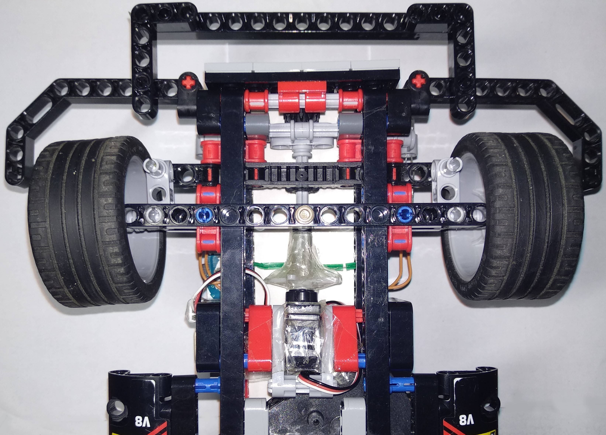


## Previous versions:

### Mark 4:
One of the first version.<br>
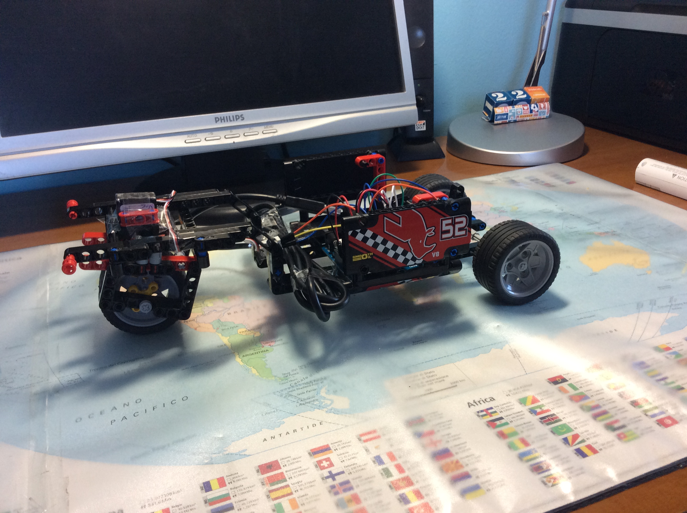
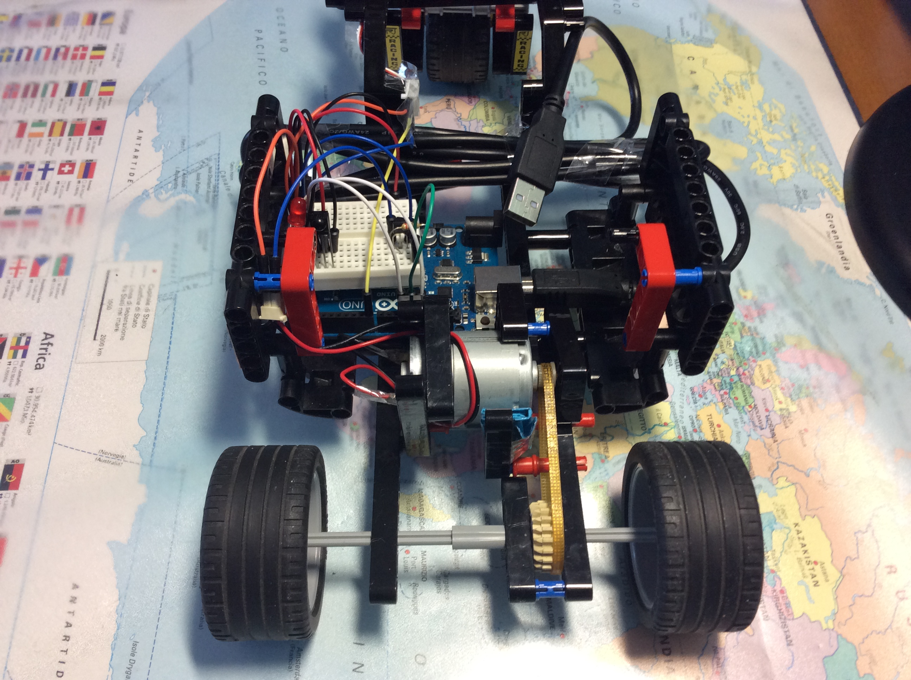

### Mark 7:
This seventh version was controlled by an infrared remote control.<br>
In the photo on the right the Arduino has been replaced by an ATmega328P.<br>
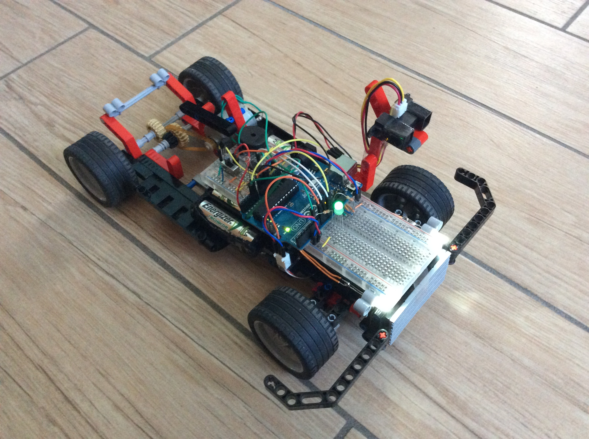
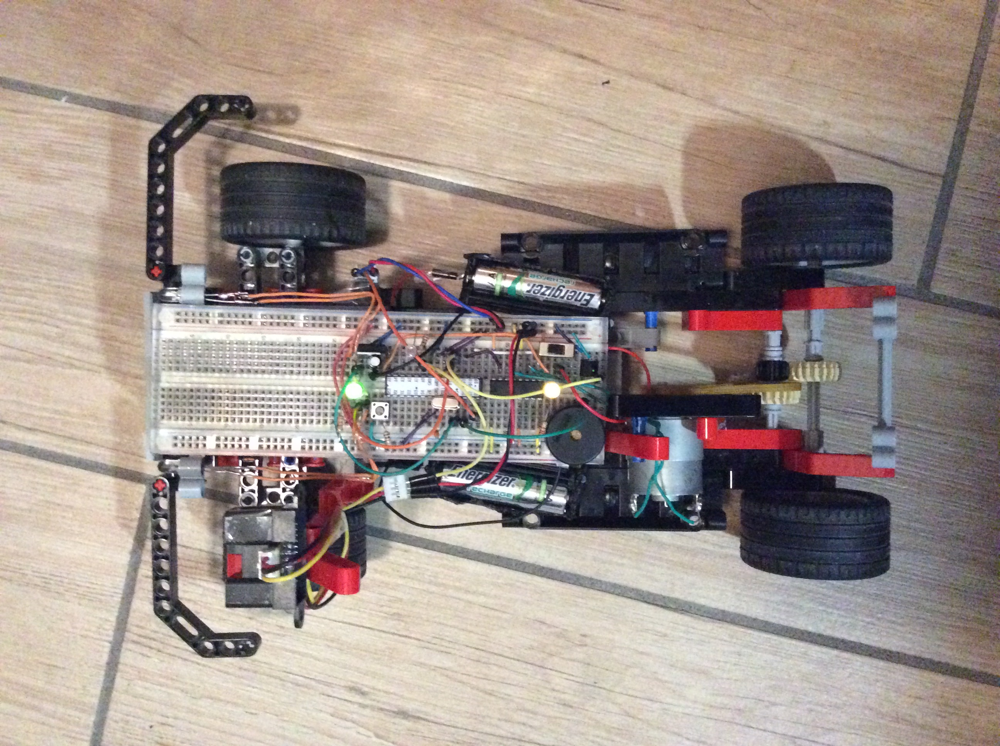

### Mark 8:
The last version.<br>
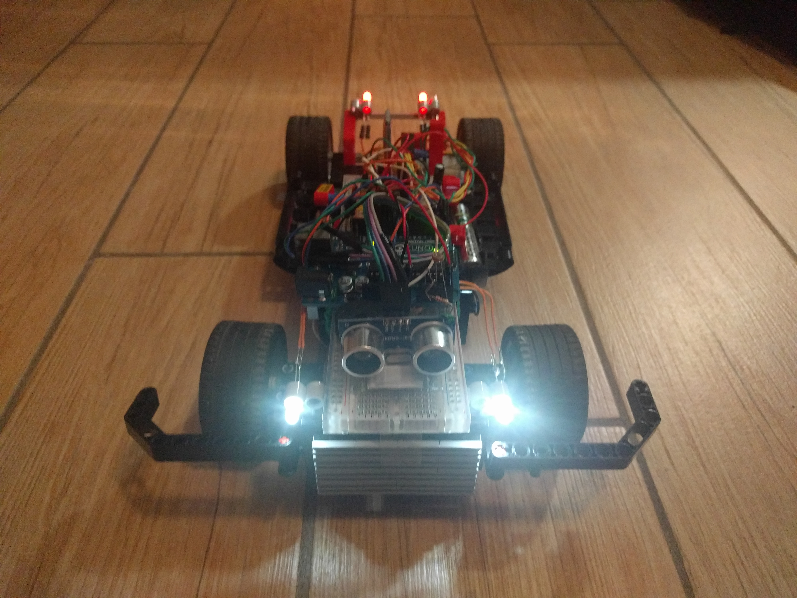
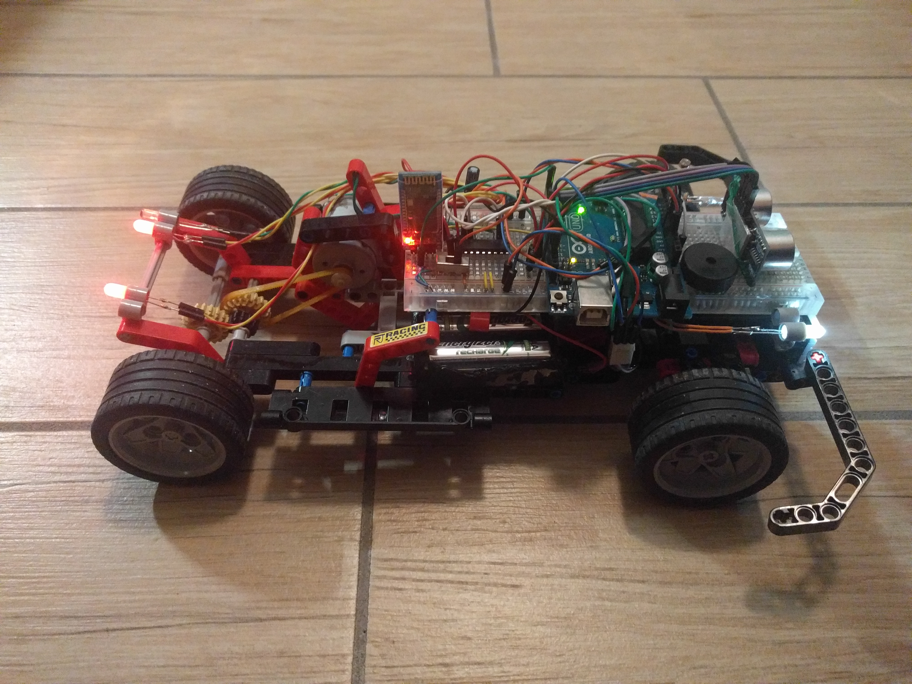
